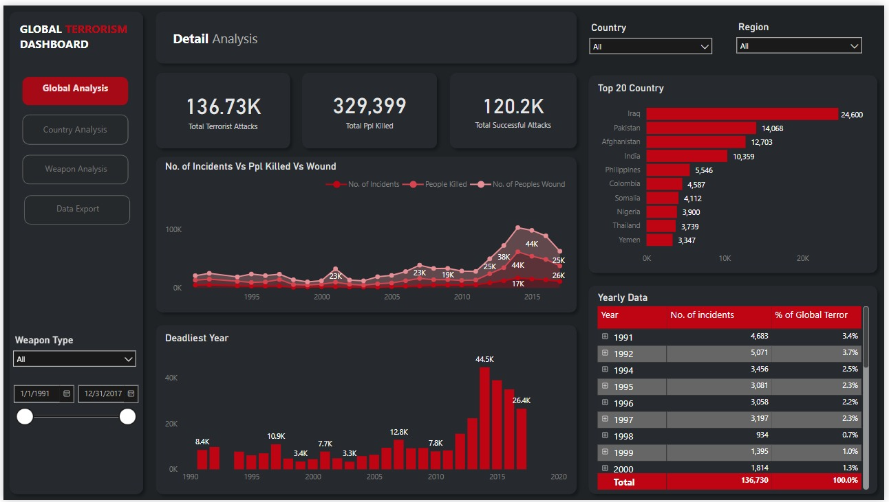
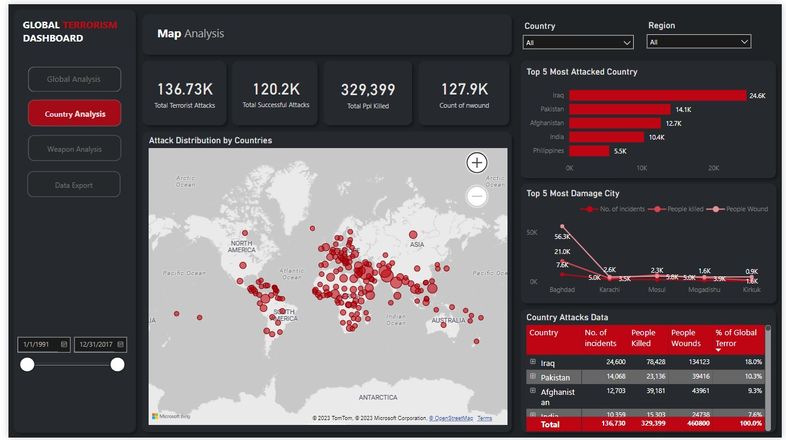
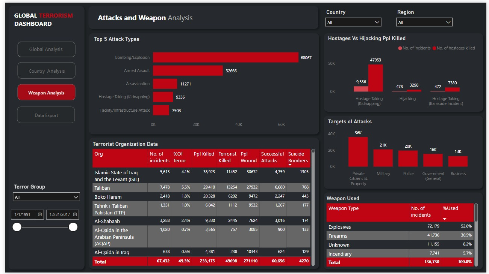

# Power BI Dashboard Creation - Global Terrorism Analysis

Terrorism Database

The Terrorism Database contains information about terrorist attacks worldwide. It includes details such as the date, location, attack type, weapons used, number of casualties,
and responsible groups. Your task is to create a Power BI dashboard that provides a comprehensive overview of global terrorism trends and patterns.

## Tasks :

  1. *Data Preparation*:
  - Import the Terrorism Database into Power BI.
  - Clean the data to handle missing values and outliers.
  - Ensure that the data types are correctly assigned.
    
  2. *Data Visualization*:
  - Create visualizations that display the number of terrorist attacks over time.
  - Visualize attack locations on a map.
  - Analyze trends in attack types and weapons used.
  - Compare casualties by region or year.

    
## Insights :

- No. of Incidents was unexpectedly high in **2014**. It had a value of **16,903**, which is outside the expected range of **9,514-14,106**.
- People Killed was unexpectedly high in **2014**. It had a value of **44,490**, which is outside the expected range of **21,201-31,293**.
- No. of Incidents trended up between 2012 and 2017 with a rise of **2,378**.
- People Killed trended up between 2010 and 2017 with a rise of **18,618**.
- *Total Terrorist Attacks analysis :*
   *  Overall Total Terrorist Attacks is currently at
      **136,730**. Total Terrorist Attacks for
      **target Private Citizens & Property**
      and other segments are significantly **higher**
      than others,
- *Total People Killed analysis :*
  *   Overall Total People Killed is currently at
      **329,399**. Total People Killed for **country Iraq**
      and other segments are significantly **higher**
      than others.
- *Total Successful Attacks analysis :*
  *  Overall Total Successful Attacks is currently at
     **120,240**. Total Successful Attacks for
     **country Iraq** and other segments are
     significantly **higher** than others.

 

